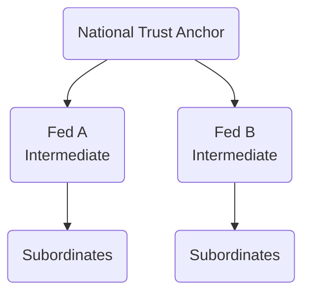
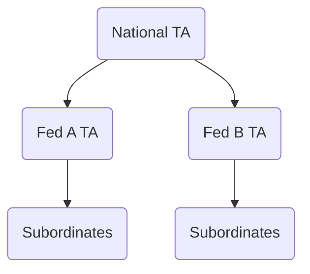
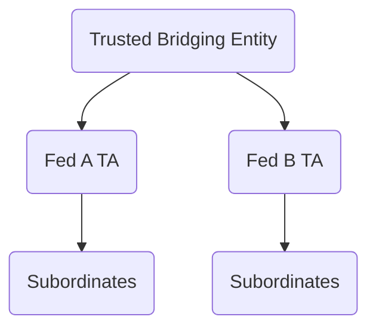
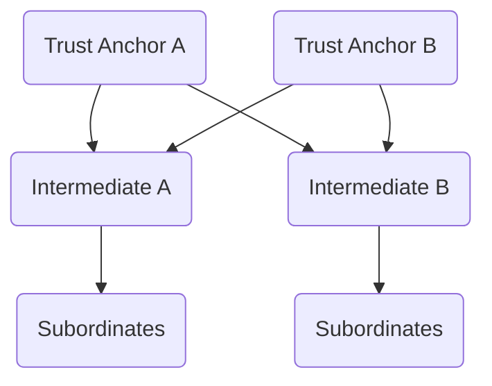

# OpenID Federation Trust Models

This document describes four architectural models for building a
national-scale OpenID Federation that incorporates existing federations and
supports cross-federation interoperability. Each model outlines the structure of
Trust Anchors, Intermediates, and trust relationships, along with an
analysis of pros and cons.

* **Hierarchical Trust Anchors (HTA):** A centralized model with a single
  National Trust Anchor, delegating to federation Intermediates.
* **Nested Trust Anchors (NTA):** A hierarchical-but-distributed model in which
  federation-local Trust Anchors point to a common national root.
* **Disconnected Trust Anchors (DTA):** A decentralized model in which
  independent Trust Anchors are made interoperable via a trusted key-publishing
  entity (TBE).
* **Interlinked Intermediates with Multi-Anchor Resolution (IIMAR):** A
  multi-rooted model in which shared Intermediates connect independently
  operated Trust Anchors, enabling interoperability without transitive trust or
  cross-signing.

## 1. Table of Contents

* [2. Terminology](#2-terminology)
* [3. Model 1: Hierarchical Trust Anchors (HTA)](#3-model-1-hierarchical-trust-anchors-hta)
  * [3.1. Structure](#31-structure)
  * [3.2. Policy Behavior](#32-policy-behavior)
  * [3.3. Trust Chain Example](#33-trust-chain-example)
  * [3.4. Resolver Behavior](#34-resolver-behavior)
  * [3.5. Trust Mark Handling](#35-trust-mark-handling)
  * [3.6. Pros](#36-pros)
  * [3.7. Cons](#37-cons)
* [4. Model 2: Nested Trust Anchors (NTA)](#4-model-2-nested-trust-anchors-nta)
  * [4.1. Structure](#41-structure)
  * [4.2. Policy Behavior](#42-policy-behavior)
  * [4.3. Trust Chain Example](#43-trust-chain-example)
  * [4.4. Resolver Behavior](#44-resolver-behavior)
  * [4.5. Trust Mark Handling](#45-trust-mark-handling)
  * [4.6. Pros](#46-pros)
  * [4.7. Cons](#47-cons)
* [5. Model 3: Disconnected Trust Anchors with External Key Distribution (DTA with TBE)](#5-model-3-disconnected-trust-anchors-with-external-key-distribution-dta-with-tbe)
  * [5.1. Structure](#51-structure)
  * [5.2. Key Management Considerations](#52-key-management-considerations)
  * [5.3. Design Constraint](#53-design-constraint)
  * [5.4. Policy Behavior](#54-policy-behavior)
  * [5.5. Trust Chain Resolution](#55-trust-chain-resolution)
  * [5.6. Trust Chain Example](#56-trust-chain-example)
  * [5.7. Resolver Behavior](#57-resolver-behavior)
  * [5.8. Trust Mark Handling](#58-trust-mark-handling)
  * [5.9. Pros](#59-pros)
  * [5.10. Cons](#510-cons)
* [6. Model 4: Interlinked Intermediates with Multi-Anchor Resolution (IIMAR)](#6-model-4-interlinked-intermediates-with-multi-anchor-resolution-iimar)
  * [6.1. Structure](#61-structure)
  * [6.2. Deployment Constraint](#62-deployment-constraint)
  * [6.3. Policy Behavior](#63-policy-behavior)
  * [6.4. Trust Chain Example](#64-trust-chain-example)
  * [6.5. Resolver Behavior](#65-resolver-behavior)
  * [6.6. Trust Mark Handling](#66-trust-mark-handling)
  * [6.7. Pros](#67-pros)
  * [6.8. Cons](#68-cons)
* [7. Key Rollover Considerations](#7-key-rollover-considerations)
* [8. Evaluation Scenarios](#8-evaluation-scenarios)
  * [8.1. Example 1: Assurance Level Trust Mark Recognition](#81-example-1-assurance-level-trust-mark-recognition)
  * [8.2. Example 2: Trust Anchor Key Rollover](#82-example-2-trust-anchor-key-rollover)
  * [8.3. Example 3: Cross‑Federation Policy Coordination](#83-example3-crossfederation-policy-coordination)
* [9. Summary](#9-summary)
  * [9.1. Model Comparison by Evaluation Criteria](#91-model-comparison-by-evaluation-criteria)
    * [9.2. Uniform national policy](#92-uniform-national-policy)
    * [9.3. Federation autonomy](#93-federation-autonomy)
    * [9.4. Validator simplicity](#94-validator-simplicity)
    * [9.5. Onboarding](#95-onboarding)
    * [9.6. Cross‑federation flexibility](#96-crossfederation-flexibility)

## 2. Terminology

* **National Trust Anchor**: A Trust Anchor that serves as the root of trust in
  a nationally governed federation deployment.
* **Federation-local Trust Anchor**: A Trust Anchor operated by an individual
  federation under the umbrella of a larger national federation. In NTA, it acts
  both as a Trust Anchor and as an Intermediate.
* **Trusted Bridging Entity (TBE)**: An out-of-band mechanism for publishing and
  distributing Trust Anchor key material in federations with Disconnected Trust
  Anchors (DTA). Not part of the OpenID Federation specification.
* **Cross-federation interoperability**: The ability for entities under different
  Trust Anchors or federation governance domains to validate and interact based
  on compatible metadata, Trust Chains, and policies.
* **Validating Entity**: An entity that performs Trust Chain resolution,
  metadata evaluation, and policy enforcement based on one or more configured
  Trust Anchors. This may be an RP, OP, or any other federation participant that
  consumes metadata and validates Trust Chains.
* **Shared Intermediate**: An Intermediate entity that is listed
  as a subordinate by more than one Trust Anchor, used in the IIMAR model to
  bridge otherwise disjoint federations.

## 3. Model 1: Hierarchical Trust Anchors (HTA)

### 3.1. Structure

* A single National Trust Anchor is the root of the trust hierarchy.
* Existing federations act as Intermediates.
* Federation Operators, acting as Intermediates, issue Subordinate Statements
  for their members (OPs, RPs).

### 3.2. Policy Behavior

* In HTA, the policy is defined at the National Trust Anchor and applied
  top-down.
* Policy claims in metadata are merged starting at the Trust Anchor and
  processed through each level until reaching the Leaf Entity.
* Only one policy chain is followed.

### 3.3. Trust Chain Example

### 3.4. Resolver Behavior

* Resolvers are configured with only the National Trust Anchor.
* Trust chains are always constructed to terminate at the National Trust Anchor.

### 3.5. Trust Mark Handling

* Trust Marks are valid only if their issuer is authorized under the National
  Trust Anchor.
* Authorization must follow one of the following two paths:
  * **Direct ownership**: If the issuing Entity (e.g., an Intermediate) is the
    owner of the Trust Mark type, it MUST be listed under that type in the
    `trust_mark_issuers` claim. The type MUST NOT appear in the
    `trust_mark_owners` claim.
  * **Delegated issuance**: If the issuing Entity is not the owner, the Trust
    Mark type MUST appear in the `trust_mark_owners` claim, and the Trust Mark
    MUST include a `delegation` claim signed by the owner. The delegated issuer
    SHOULD also be listed under the corresponding type in the
    `trust_mark_issuers` claim to indicate that the delegation is recognized by
    the National Trust Anchor.
* The validating entity MUST ensure that the Trust Mark issuer is reachable via
  a Trust Chain terminating at the National Trust Anchor.

### 3.6. Pros

* Centralized governance ensures uniform policy enforcement, while
  Intermediates retain operational control over local entities.
* Trust chains are clear, deterministic, and always anchored at a single Trust
  Anchor, simplifying validation logic.
* Metadata policy and constraints are applied top-down from the National Trust Anchor
  through each subordinate level.
* Fully compatible with standard OpenID Federation validation mechanisms and
  tooling.

### 3.7. Cons

* Trust Mark Issuers must be explicitly listed by the National Trust Anchor to
  be valid. Intermediates cannot authorize issuers unless delegated through the
  TA’s `trust_mark_issuers` or `trust_mark_owners` claims.
* Centralized onboarding and Trust Mark governance increase operational overhead
  and require structured coordination.
* All policy enforcement is top-down, limiting flexibility for
  federation-specific adaptations.

## 4. Model 2: Nested Trust Anchors (NTA)

### 4.1. Structure

* Each existing federation operates its own **Trust Anchor**.
* These Trust Anchors are not independent; each Trust Anchor is also an
  Intermediate and includes `authority_hints` pointing to a **superior Trust
  Anchor**, typically the National Trust Anchor.
* Chains are resolved recursively up to the National Trust Anchor.
* When two entities reside under the same federation-local Trust Anchor and the
  validator is configured to trust that Trust Anchor directly, validation and
  policy merging can be performed locally. When the entities are in different
  federations, resolution proceeds through the National Trust Anchor and
  includes both local and national statements.

### 4.2. Policy Behavior

* Policy merging occurs based on the starting point of Trust Chain resolution.
* If the validator starts at the National Trust Anchor, policies are merged
  recursively down through each federation-local Trust Anchor.
* If the validator starts at a federation-local Trust Anchor, the policy chain
  will be resolved and applied locally within that autonomous federation,
  without invoking the national-level policy.
* To preserve this autonomy, the policy defined at the National Trust Anchor
  should remain minimal, delegating the definition of most metadata constraints
  and conformance requirements to the federation-local Trust Anchors and
  Federation Operators (FOs). This facilitates adaptation to federation-specific
  regulatory, operational, or sectoral requirements while ensuring overall
  compliance with the federation's trust framework.
* Each entity in the chain contributes policy through its published Entity
  Statement. It is the same Entity Statement in both cases, whether the entity
  is acting as a Trust Anchor or as an Intermediate. The policy it defines is
  identical and interpreted uniformly by validators.

### 4.3. Trust Chain Example

### 4.4. Resolver Behavior

* Resolution scoped to a federation-local Trust Anchor is confined to that
  federation and terminates at that Trust Anchor. The National Trust Anchor is
  not consulted.
* Resolution scoped to the National Trust Anchor includes the relevant
  federation-local Trust Anchor as an Intermediate and terminates at the
  National Trust Anchor.
* When a resolve request includes multiple Trust Anchors, a federation-local
  Trust Anchor and the National Trust Anchor, the resolver SHOULD return the
  Trust Chain that terminates at the federation-local Trust Anchor.

### 4.5. Trust Mark Handling

* Trust Marks are valid only if their issuer is authorized under the Trust Chain
  selected by the validating entity. This Trust Chain may terminate at a
  federation-local Trust Anchor or at the National Trust Anchor.
* Authorization must follow one of the following two paths:
  * **Direct ownership**: If the issuing Entity is the owner of the Trust Mark
    type, it MUST be listed under that type in the `trust_mark_issuers` claim
    published by the Trust Anchor at the top of the selected chain. The type
    MUST NOT appear in the `trust_mark_owners` claim under that anchor.
  * **Delegated issuance**: If the issuing Entity is not the owner, the Trust
    Mark type MUST appear in the `trust_mark_owners` claim published by the
    Trust Anchor at the top of the selected chain, and the Trust Mark MUST
    include a `delegation` claim signed by the declared owner. The delegated
    issuer SHOULD also be listed under the corresponding type in the
    `trust_mark_issuers` claim to indicate that the delegation is recognized
    under that Trust Anchor.
* The validating entity MUST ensure that the Trust Mark issuer is reachable via
  a Trust Chain terminating at the selected Trust Anchor. When resolving across
  federations, this typically means the chain terminates at the National Trust
  Anchor, and any federation-local Trust Anchors act as Intermediates. In such
  cases, the issuer must be authorized under the National TA’s published
  metadata.

### 4.6. Pros

* Each federation controls its own Trust Anchor.
* Federation-local Trust Anchors manage their own keys. They are not required to
  maintain keys from other federations.
* Supports layered trust and policy delegation.
* Complies with OpenID Federation 1.0 recursive Trust Chain validation.
* Enables integration of independently operated federations.
* Cross-federation validation has a single Trust Anchor, simplifying
  cross-federation trust evaluation.

### 4.7. Cons

* Validating entities must support multi-level Trust Chain resolution.
* Trust Mark Issuers may need to be authorized under the Trust Anchor used for
  validation, typically the National Trust Anchor.
* Metadata policy merging across trust levels can result in inconsistent
  behavior if not coordinated.
* Validation outcomes may vary depending on which Trust Anchor is selected,
  requiring clear resolution policy.

## 5. Model 3: Disconnected Trust Anchors with External Key Distribution (DTA with TBE)

### 5.1. Structure

* Each federation operates an independent Trust Anchor.
* There is no cryptographic or hierarchical relationship between Trust Anchors.
* A **Trusted Bridging Entity (TBE)** serves as an out-of-band source of Trust
  Anchor key material. The TBE is not defined in the OpenID Federation 1.0
  specification and introduces a non-standard trust distribution model.
* The TBE allows relying parties and other validating entities to obtain the
  public keys of independently operated Trust Anchors. This enables
  cross-federation validation without a common root or chain of entity
  statements.
* Entities that perform Trust Chain validation must support retrieval and
  verification of Trust Anchor keys from the TBE. This requires explicit
  implementation support for key acquisition and trust configuration outside the
  federation metadata model.
* The trust model, key format, and retrieval mechanism used by the TBE must be
  profiled or standardized separately to ensure consistent behavior.

### 5.2. Key Management Considerations

Each validating entity in DTA must manage its own set of trusted Trust Anchor
keys. This trust configuration may be static or dynamically retrieved through a
TBE mechanism.

The TBE is not defined in the OpenID Federation 1.0 specification. It refers to
any agreed mechanism for publishing and retrieving Trust Anchor key material
across federations. This may include:

* Hosting Trust Anchor JWKS at a well-known HTTPS endpoint.
* Including key material in Entity Configuration documents served at known URLs.
* Publishing signed key sets through a registry operated under shared
  governance.

If such a retrieval mechanism is defined and adopted across participating Trust
Anchors, it fulfills the role of the TBE. In this case, validators may
dynamically retrieve keys and refresh them on rollover. The method, timing, and
transition process for rollover are determined by the TBE.

Validators are expected to support signature verification using multiple keys
published in a JWKS. This enables key rollover and ensures continuity.
Validators must also monitor key expiration and ensure that trusted key material
remains up to date. Failure to do so may result in trust failures at runtime.

### 5.3. Design Constraint

DTA assumes a flat federation topology in which each Trust Anchor operates
independently. The OpenID Federation 1.0 specification permits broad variation
in how Trust Anchors issue metadata, validate Trust Marks, and interpret policy
claims. Without coordination, this flexibility leads to incompatible behaviors.

For cross-federation trust to be viable under this model, participating Trust
Anchors must agree on shared policy rules. This policy must be enforced at the
point where Trust Anchors publish their keys, typically via a TBE or equivalent
registry.

In the absence of a governed cross-federation policy, there is no mechanism to
ensure aligned behavior across Trust Anchors. Validators will be unable to make
consistent decisions. As a result, the model will fail to support
interoperability in practice.

Any deployment of DTA intended to support cross-federation validation must
include a governance structure that defines and enforces shared conformance
requirements as a condition for inclusion in the TBE.

### 5.4. Policy Behavior

* There is no shared policy hierarchy. Each Trust Anchor defines its own policy
  independently.
* Cross-federation alignment is achieved through shared conformance
  requirements, established as a condition for inclusion in the TBE.
* Policy merging is scoped to the selected Trust Chain and applies only to
  statements issued under the terminating Trust Anchor.
* Validators determine which Trust Chains to accept based on their configured
  trust set and may apply additional local constraints beyond those required by
  the TBE.

### 5.5. Trust Chain Resolution

* Entities that perform Trust Chain resolution must be able to build a trust
  chain from a foreign Trust Anchor using its public key, which is retrieved
  from the TBE.
* Each entity that performs Trust Chain resolution is responsible for managing
  its own set of accepted Trust Anchors and corresponding key material, either
  statically or by retrieving keys from the TBE.

### 5.6. Trust Chain Example

### 5.7. Resolver Behavior

* Each Resolver is explicitly configured with a trust set consisting of one or
  more Trust Anchors.
* Trust Anchor keys MUST be retrieved through the TBE using the agreed key
  publication mechanism.
* Resolvers validate each Trust Chain independently, relative to the Trust
  Anchor it terminates in.
* If multiple valid chains exist for a given entity, each terminating in a
  different Trust Anchor, the Resolver MAY select which chain(s) to evaluate
  based on local policy.
* All metadata validation, policy evaluation, and Trust Mark handling are scoped
  strictly to the selected Trust Anchor. There is no transitive trust or
  cross-federation-wide context.

### 5.8. Trust Mark Handling

* Trust Marks are valid only if their issuer is authorized within the trust
  chain selected by the validating entity. Within a governed DTA deployment,
  where Trust Anchors are included in the TBE based on shared conformance
  requirements, authorization must follow one of the following two paths:
  * **Direct ownership**: If the issuing Entity is the owner of the Trust Mark
    type, it MUST be listed under that type in the `trust_mark_issuers` claim
    published by the selected Trust Anchor. The type MUST NOT appear in the
    `trust_mark_owners` claim under that anchor.
  * **Delegated issuance**: If the issuing Entity is not the owner, the Trust
    Mark type MUST appear in the `trust_mark_owners` claim published by the
    selected Trust Anchor, and the Trust Mark MUST include a `delegation` claim
    signed by the declared owner. The delegated issuer SHOULD also be listed
    under the same type in the `trust_mark_issuers` claim to indicate that the
    delegation is recognized under that Trust Anchor.
* The validating entity MUST ensure that the Trust Mark issuer is reachable via
  a Trust Chain terminating at one of its configured Trust Anchors. There is no
  global trust context. Trust Mark acceptance is scoped to the validator's local
  trust configuration and the policies of the Trust Anchors it supports.

### 5.9. Pros

* Federations retain operational autonomy while adhering to shared conformance
  rules defined by the TBE.
* Enables selective interoperability between independently operated Trust
  Anchors without requiring a shared root or common hierarchy.
* Validators can trust and validate multiple Trust Anchors in parallel, each
  with independently scoped Trust Chains.
* Cross-federation validation is possible without relying on hierarchical trust
  resolution or transitive authority.

### 5.10. Cons

* The TBE is not part of the OpenID Federation specification. It introduces an
  external and non-standard trust distribution mechanism that must be defined
  and governed separately.
* Participation in the TBE requires coordination, onboarding procedures, and
  conformance to shared policy, increasing administrative overhead.
* No signed trust relationships exist between Trust Anchors. Validation is
  confined to the local Trust Chain selected by the validator.
* The model relies on out-of-band agreement to enforce interoperability. Without
  active governance, policy divergence and inconsistent validation behaviors
  remain likely.

## 6. Model 4: Interlinked Intermediates with Multi-Anchor Resolution (IIMAR)

### 6.1. Structure

* This model involves two or more Trust Anchors that operate independently.
* Intermediate Entities are directly subordinate to all Trust Anchors. This
  results in a convergence point. Intermediates act as the connecting layer
  between multiple disjoint Trust Chains.
* Leaf entities are subordinate to a single Intermediate. Their Trust Chain can
  terminate at any of the Trust Anchors that list the Intermediate, depending on
  the selected path.
* This model enables interoperability across Trust Anchors without requiring
  direct trust relationships or cross-signing between Trust Anchors.

### 6.2. Deployment Constraint

* In IIMAR, each Leaf Entity is typically configured with a single Trust Anchor.
  All validation, including resolution, policy application, and Trust Mark
  verification, is scoped to the Trust Chain that terminates at that Trust
  Anchor.
* Trust Mark acceptance is not transitive across Trust Anchors. Each Trust
  Anchor must independently publish the metadata required to authorize Trust
  Mark usage under its domain.
* To ensure interoperability of Trust Marks across federations connected via
  shared Intermediates:
  * **Trust Mark Owners** MUST be listed in the `trust_mark_owners` claim of
    each Trust Anchor where their Trust Marks are to be accepted.
  * **Trust Mark Issuers** MUST be authorized under each Trust Anchor either:
    * by being listed directly under the corresponding Trust Mark type in the
      `trust_mark_issuers` claim, or
    * by holding a valid delegation from an owner listed in the
      `trust_mark_owners` claim. In this case, the Trust Mark MUST include a
      `delegation` claim signed by the owner. The delegated issuer SHOULD also
      appear in the `trust_mark_issuers` claim to signal recognition by the
      Trust Anchor.
* Operators MUST coordinate Trust Mark publication across all participating
  Trust Anchors to ensure consistent validation outcomes across validators
  configured with different Trust Chains.

### 6.3. Policy Behavior

* Each Trust Anchor defines and publishes its own metadata policy.
* Intermediates inherit or merge policies from each Trust Anchor they serve, and
  may define additional constraints.
* Policy merging during Trust Chain validation is determined by the terminating
  Trust Anchor selected by the validating entity.
* Because multiple paths to different Trust Anchors may exist, entities must
  select the chain that leads to a Trust Anchor they explicitly trust.
* Metadata policy application follows the selected chain only. No cross-chain
  policy composition is permitted.

### 6.4. Trust Chain Example

### 6.5. Resolver Behavior

* In IIMAR, the same entity may be reachable through multiple valid trust
  chains, each terminating in a different Trust Anchor.
* The Resolver MUST treat each Trust Chain as isolated. Even when the
  Intermediate is shared, metadata, policy, and Trust Mark evaluation MUST be
  scoped exclusively to the selected chain.
* Entities that rely on resolution results MUST understand that validation
  outcomes may differ depending on which Trust Anchor is selected.
* This model allows for multiple parallel trust contexts to exist for the same
  entity, each defined by the policy and authority of the terminating Trust
  Anchor.

### 6.6. Trust Mark Handling

* Trust Marks are valid only if the Trust Mark Issuer is reachable through the
  same chain used during trust resolution.
* The issuer must be subordinate to (or explicitly listed by) the selected Trust
  Anchor.
* Intermediates may issue Trust Marks only if delegated by the Trust Anchor that
  the validating entity chooses to anchor trust in.
* Multiple Trust Mark issuers may be supported via the intermediary, but they
  are scoped by the Trust Anchor under which they are published.

### 6.7. Pros

* Supports cross-federation trust without requiring a shared Trust Anchor.
* Intermediates enable interoperability by serving multiple Trust Anchors,
  without requiring one Trust Anchor to act as an Intermediate under another.
* Trust relationships and resolution remain fully compliant with the OpenID
  Federation Trust Chain model.
* Entities can participate in multiple federations via a single Intermediate,
  reducing duplication and administrative overhead.
* Enables gradual integration of independently governed federations into a
  shared ecosystem, without altering their internal trust structures.

### 6.8. Cons

* Requires Intermediates to maintain multiple signing relationships and
  policies per Trust Anchor.
* Complexity increases as more Trust Anchors are added and Intermediates bridge them.
* Trust Mark validation is strictly scoped to the selected chain, which may lead
  to fragmentation if issuers are not widely accepted.
* Policy consistency is not guaranteed across chains since policy is Trust
  Anchor-specific and resolution is path-dependent.

## 7. Key Rollover Considerations

Key rollover is a critical operational aspect of all trust models, but presents
different challenges depending on the architecture. The table below lists only
the rollover factors that differ by architecture.

| Model | Architecture-specific rollover factors |
|-------|----------------------------------------|
| **HTA** | One National Trust Anchor. When its key changes, every validating entity that trusts it installs the new key. No further coordination is needed. |
| **NTA** | Two layers. If a federation-local Trust Anchor changes its key, the National Trust Anchor re-signs the Subordinate Statement and validators that trust the local Trust Anchor install the new key. If the National Trust Anchor changes its key, all validators install the new key. |
| **DTA** | Flat set of independent Trust Anchors. Each validator maintains the keys of every Trust Anchor it trusts. When any Trust Anchor rolls over, every validator installs the new key, usually from the TBE. Operational load and risk increase with the number of Trust Anchors. |
| **IIMAR** | Several independent Trust Anchors operate in parallel and share Intermediates that bridge federations. When any Trust Anchor rotates its key, every entity that trusts that Trust Anchor, including cross-federation Intermediates, must add the new key. |

## 8. Evaluation Scenarios

This section illustrates how the three trust models behave under common
cross-federation interoperability conditions.

### 8.1. Example 1: Assurance Level Trust Mark Recognition

An RP in Federation A wants to accept users from Federation B, but only if their
OP presents a verified AL-High Trust Mark issued by a common accreditation body.

* **HTA**: Supported if the Trust Mark Issuer is authorized under the National
  Trust Anchor and is reachable via the Trust Chain. All validation is
  centralized.
* **NTA**: Supported if the Trust Mark Issuer is authorized under the National
  Trust Anchor.
* **DTA**: Supported only if the RP explicitly trusts the Trust Anchor that
  authorizes the Trust Mark Issuer. There is no federation-wide inheritance.
  Each Trust Anchor must publish Trust Mark metadata independently.
* **IIMAR**: Supported if the Trust Mark Issuer is reachable through the Trust
  Chain terminating at the RP's configured Trust Anchor. There is no transitive
  recognition between Trust Anchors. Each Trust Anchor must independently
  publish Trust Mark metadata where the Trust Mark is to be accepted.

### 8.2. Example 2: Trust Anchor Key Rollover

Federation B rotates the signing key of its Trust Anchor or Intermediate using a
standard overlap procedure. The entity first publishes a statement containing
both the old and new keys, then later removes the old key. An RP in Federation A
continues to interact with an OP in Federation B during the rollover.

* **HTA**: The Intermediate for Federation B updates its key and informs the
  National Trust Anchor. Validators continue to validate chains without
  interruption.
* **NTA**: The federation-local Trust Anchor updates its key and informs the
  National Trust Anchor. The National Trust Anchor re-signs its Subordinate
  Statement for the local Trust Anchor (treated as an Intermediate from the
  National Trust Anchor’s perspective). Validators continue to validate chains without
  interruption.
* **DTA**: The Trust Anchor updates its key and propagates it to the TBE. Each
  validator that trusts the Trust Anchor must retrieve the new key before it is
  used. Validation fails unless the update is timely.
* **IIMAR**: The Trust Anchor for Federation B updates its key. Validators that
  trust it retrieve the new key based on the published Entity Configuration.
  Validators continue to validate chains without interruption.

### 8.3. Example 3: Cross‑Federation Policy Coordination

A new legal requirement states that every OP handling sensitive personal data
must publish `userinfo_signed_response_alg = RS256` in its metadata. RPs are
expected to rely on this constraint and reject any OP that does not comply.

* **HTA**: The National Trust Anchor adds the constraint to its federation‑wide
  policy and distributes it through all Subordinate Statements. Every trust
  chain ends at the National Trust Anchor, so all OPs must conform and every RP
  receives uniform metadata. Coordination is complete and guaranteed.
* **NTA**: The National Trust Anchor publishes the constraint in its own
  statements. Any cross‑federation chain includes that statement, so OPs that
  interact outside their local federation must comply. A federation‑local Trust
  Anchor may still define additional or different rules for purely local
  traffic. National interoperability is enforced, while local flexibility
  remains.
* **DTA**: No shared policy source exists. Each Trust Anchor decides whether to
  require `RS256`. An RP enforces only what its chosen Trust Anchor mandates.
  Some RPs may reject non‑compliant OPs, others may accept them. There is no
  coordinated enforcement, so consistency cannot be assumed.
* **IIMAR**: Multiple independent Trust Anchors share the same Intermediates, but
  each Trust Anchor sets policy independently. An RP anchored to TA A enforces
  only TA A’s rules; an RP anchored to TA B enforces TA B’s rules. Coordination
  is possible only if every Trust Anchor adopts the same constraint. Otherwise,
  OPs may be accepted in one federation but rejected in another, and
  Intermediates do not reconcile the difference.

## 9. Summary

This document compares four trust models for building a national-scale OpenID
Federation: **Hierarchical Trust Anchors (HTA)**, **Nested Trust Anchors
(NTA)**, **Disconnected Trust Anchors (DTA)**, and **Interlinked Intermediates
with Multi-Anchor Resolution (IIMAR)**. Each model defines a different structure
for distributing trust, managing key material, applying policy, and supporting
interoperability across federations.

* **HTA**: centralizes all trust and policy at a single National Trust Anchor,
  enabling deterministic Trust Chains and uniform enforcement but requiring
  strong central governance and coordination.
* **NTA**: distributes operational control to federation-local Trust Anchors
  while preserving hierarchical policy alignment via a shared national root.
  This model balances autonomy with national-level oversight.
* **DTA**: is non-hierarchical, relying on a non-standard Trusted
  Bridging Entity (TBE) for key distribution. It supports decentralized
  operation but introduces complexity and governance requirements outside the
  OpenID Federation specification.
* **IIMAR**: enables interoperability through shared Intermediates listed under
  multiple Trust Anchors. It supports flexible federation integration without
  cross-signing but increases complexity in validation, Trust Mark management,
  and policy consistency.

All models are compatible with OpenID Federation 1.0’s core validation and trust
chain semantics but offer different trade-offs in terms of governance,
scalability, policy control, and operational overhead. The choice of model
depends on regulatory requirements, existing federation infrastructure, and the
desired balance between centralization and autonomy.

### 9.1. Model Comparison by Evaluation Criteria

| Criteria                         | HTA   | NTA   | DTA   | IIMAR |
| -------------------------------- | ----- | ----- | ----- | ----- |
| **Uniform national policy**      | ★★★★★ | ★★★★☆ | ★☆☆☆☆ | ★★☆☆☆ |
| **Federation autonomy**          | ★★☆☆☆ | ★★★★☆ | ★★★★★ | ★★★★☆ |
| **Validator simplicity**         | ★★★★★ | ★★★☆☆ | ★☆☆☆☆ | ★★★☆☆ |
| **Onboarding**                   | ★★★☆☆ | ★★★☆☆ | ★★★★☆ | ★★★☆☆ |
| **Cross‑federation flexibility** | ★★☆☆☆ | ★★★★☆ | ★★★☆☆ | ★★★★★ |

#### 9.2. Uniform national policy

* **HTA (★★★★★):** Centralized model with one National Trust Anchor controlling policy
  ensures perfect uniformity.
* **NTA (★★★★☆):** Still allows national policy enforcement, but
  federation-local Trust Anchors can override for local traffic.
* **DTA (★☆☆☆☆):** No shared policy mechanism. Each Trust Anchor defines policy
  independently.
* **IIMAR (★★☆☆☆):** Multiple Trust Anchors publish policy independently.
  Coordination is possible, but not guaranteed.

#### 9.3. Federation autonomy

* **HTA (★★☆☆☆):** Intermediates have operational control but no policy
  autonomy. All policy flows top-down.
* **NTA (★★★★☆):** Federation-local Trust Anchors manage their own policies while
  operating under a national root.
* **DTA (★★★★★):** Full autonomy. No hierarchical constraints.
* **IIMAR (★★★★☆):** Each federation operates its own Trust Anchor.
  Intermediates may carry cross-federation connections, but policy is Trust
  Anchorr-specific.

#### 9.4. Validator simplicity

* **HTA (★★★★★):** Validators only need to trust a single Trust Anchor.
  Resolution is deterministic and linear.
* **NTA (★★★☆☆):** Validators must support multi-level recursive resolution.
* **DTA (★☆☆☆☆):** Validators must manage many disjoint Trust Anchor keys, trust
  contexts, and out-of-band key sources (TBE).
* **IIMAR (★★★☆☆):** Validators must choose among multiple chains and understand
  parallel trust contexts.

#### 9.5. Onboarding

* **HTA (★★★☆☆):** Requires centralized coordination for Trust Mark inclusion
  and subordinate registration.
* **NTA (★★★☆☆):** Federation-local onboarding is possible, but coordination
  with national Trust Anchor is still needed for full reach.
* **DTA (★★★★☆):** Federations onboard independently, as long as they conform to
  TBE rules. Less centralized friction.
* **IIMAR (★★★☆☆):** Onboarding happens under individual Trust Anchors, but shared
  Intermediates must be coordinated.

#### 9.6. Cross‑federation flexibility

* **HTA (★★☆☆☆):** All cross-federation interactions flow through the National
  Trust Anchor. Flexible only via central configuration.
* **NTA (★★★★☆):** Enables cross-federation validation with national oversight,
  preserving some local control.
* **DTA (★★★☆☆):** Interoperability is possible, but requires prior agreement on
  shared policy and validator configuration.
* **IIMAR (★★★★★):** Highly flexible model. Entities can be reachable via
  multiple Trust Chains, supporting dynamic interoperability.
